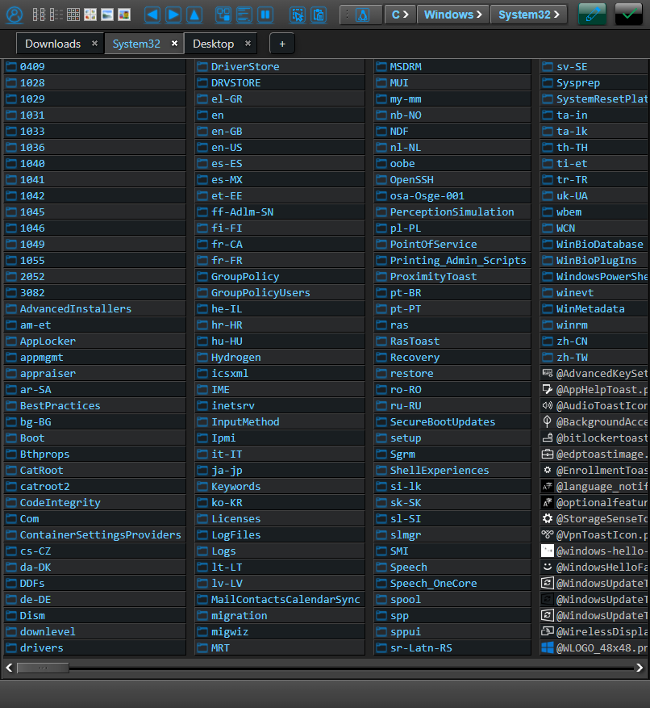

# Lyrida: web-based file explorer
Explore your files with ease and flexibility. Lyrida is an open-source, web-based client/server file explorer, designed to streamline the way you interact with your filesystem in the browser. With Lyrida, simplicity meets functionality, giving you the power to manage your files efficiently, without the need for complex setups.

## Features

### Security
Lyrida uses a token-based authentication system, ensuring your login remains secure with industry-standard [Argon2](https://github.com/kmaragon/Konscious.Security.Cryptography) cryptographic hashing. For those who prioritize extra security, Lyrida offers 2FA (Two-Factor Authentication) using TOTP (Time-Based One-Time Password). This means that after entering your regular username and password, you'll verify your identity with a second, temporary code generated by apps like Authy, Google Authenticator, or Aegis Authenticator.

Why use 2FA with TOTP? It adds a strong layer of security, because even if someone gets hold of your password, they can't access your files without this unique, time-sensitive code. 

### Multiple data sources

Lyrida supports multiple sources for file explorer:

- Local File System (either the host system, or docker volumes, depending on installation mode)
- File Transfer Protocol (not yet implemented)
- Google Drive (not yet implemented)

### All file system operations

You can cut/copy/paste/rename/delete/upload/download files and directories, as well as create new directories and text files. The selection of files can be performed both by mouse (rectangle drag or items click) or taps, on mobile devices. Traditional keyboard shortcuts are supported (Ctrl+C, Ctrl+V, etc), and dangerous operations such as deletion require a secure confirmation. 

### Tabbed browser

You can open multiple tabs, each with a different data source, location, display setting, etc. You also have the option of remembering open tabs, such that they are automatically restored when you open Lyrida again, even across different devices. Operations like copying or dragging elements between tabs is permitted. Each tab also offers the option Split View, where you can watch two different locations at the same time, in the same tab (to be implemented).

### Mobile friendly

Lyrida offers six file system display layouts - list, details, and four icon sizes (small to extra large) - reflecting the versatile design of desktop file explorers. Optimized for both large and small screens, the layouts ensure a seamless experience on desktops, mobile phones, and tablets. The responsive interface smartly adjusts to the screen size, while the functionality, such as selection and navigation, is intuitively designed for interaction with either a mouse or touch, depending on your device.

### Photo, audio, video and text viewer

Lyrida offers customizable media viewing options. You can choose to display thumbnails for image files, which also open in a full-width carousel for an immersive viewing experience. This carousel includes a filmstrip of thumbnails at the bottom, allowing for swift navigation between images. Integrated audio and video players are designed to stream your audio and video files effectively (to be implemented). Additionally, Lyrida provides a preview pane for text files, allowing you to glimpse the content without downloading and opening the file in a separate application.

### Customizability 

Extensive customizations can be done, starting from user preferences and ending with color schemes and icons themes.

Multiple other features are available, and they are listed in the detailed presentation at the link below. 

## Documentation

- **[Installation](./documents/INSTALLATION.MD)**
- **[Usage](./documents/USAGE.MD)**
- **[FAQ]()**

## Contributing

Lyrida welcomes community contributions. All forms of input, be it code, bug reports, or feature suggestions, are appreciated.

## Acknowledgments and Credits

### Visual style

This project has drawn inspiration from the visual style and certain graphic elements of [Enlightenment](https://www.enlightenment.org/), a Window Manager, Compositor, and Minimal Desktop for Linux and other compatible UNIX systems. Their distinctive design has greatly influenced the aesthetics of this project, and I wish to express my profound appreciation for their innovative work.

Any modifications or adaptations made to the original graphics and styles are my responsibility. All rights, acknowledgments, and credits for the original design elements belong to the Enlightenment project and its contributors.

To explore more about Enlightenment and their contributions to the open-source community, please visit the [official Enlightenment website](https://www.enlightenment.org/).

### Icons

Most icons were taken from [Lyra Icon Theme](https://github.com/yeyushengfan258/Lyra-icon-theme/tree/master/src), a beautiful icon theme for Linux desktops.

Several icons used in this project were adapted from icons sourced from [OnlineWebFonts](https://www.onlinewebfonts.com/icon). These icons are licensed under [CC BY 4.0](https://creativecommons.org/licenses/by/4.0/).

- [`os.svg`](https://www.onlinewebfonts.com/icon/241211)
- [`cut.svg`](https://www.onlinewebfonts.com/icon/52112)
- [`atom.svg`](https://www.onlinewebfonts.com/icon/193445)
- [`copy.svg`](https://www.onlinewebfonts.com/icon/569600)
- [`move.svg`](https://www.onlinewebfonts.com/icon/233790)
- [`link.svg`](https://www.onlinewebfonts.com/icon/389791)
- [`paste.svg`](https://www.onlinewebfonts.com/icon/487532)
- [`cursor.svg`](https://www.onlinewebfonts.com/icon/521421)
- [`delete.svg`](https://www.onlinewebfonts.com/icon/564261)
- [`rename.svg`](https://www.onlinewebfonts.com/icon/138529)
- [`download.svg`](https://www.onlinewebfonts.com/icon/574052)
- [`new-file.svg`](https://www.onlinewebfonts.com/icon/569609)
- [`new-directory.svg`](https://www.onlinewebfonts.com/icon/572641)

Some other icons were taken from [UXWing Icons](https://uxwing.com/). Although the license doesn't require a mention of author, still, here it is:

- [`ftp.svg`](https://uxwing.com/ftp-icon/)
- [`sftp.svg`](https://uxwing.com/sftp-icon/)

### Image viewer

The image viewer used in this application is provided by [ViewerJs](https://github.com/fengyuanchen/viewerjs).

### Notification system

The notification system used in this application is provided by [SweetAlert](https://sweetalert.js.org/).

### Keyboard shortcuts

The functionality for handling keyboard shortcuts is provided by [OpenJs](https://www.openjs.com/scripts/events/keyboard_shortcuts/).

**I greatly appreciate the creators and contributors for providing these assets.**

## License

This project is licensed under the GPLv3.0. See the [LICENSE](./documents/LICENSE.MD) file for details.
