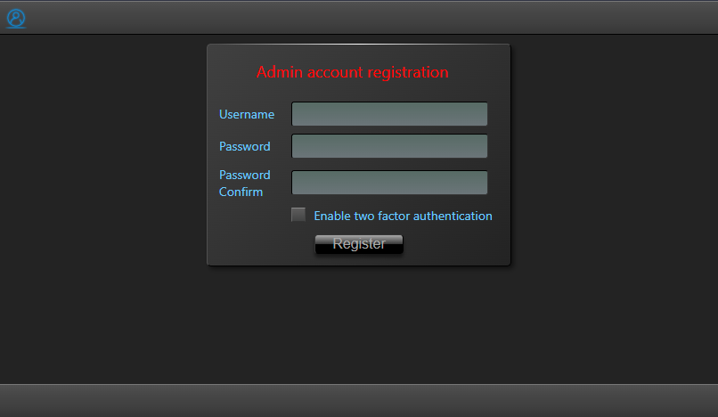
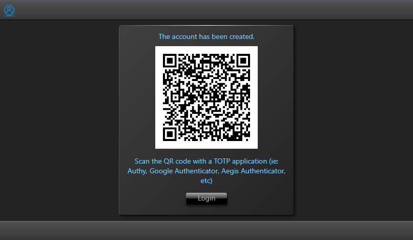

## Usage ##

### Data sources setup ###

Upon installing and running the client and the server app, you can visit the URL of the client in a browser, where you will be presented with the web page for configuring the Admin user account:

It is **strongly** recommended to enable 2FA authentication, otherwise, there will be no way to recover your account, in case you forget your password!

Once you submit the data, if you chose to enable 2FA, you will be presented with a QR code that you can scan with an authenticator app, such as Aegis Authenticator, Google Authenticator, or Authy:

Aftwerwards, you can proceed to the login page. If you enabled 2FA TOTP, after you will provide your username and password, you will be asked to enter the 6 digit random code generated each minute by the authenticator app that you used to scan the QR code when you created the account:

After logging in, you can start adding services that will be the file system data providers of Lyrida:

Once added, you can configure their parameters (don't forget to click "Save" at the end!):

Finally, when you are done setting data sources, you can click on the account icon in the top left corner, and chose "File System". This will take you to the main page where you will interact with the file explorer. Click on the "Add Tab" icon (the square with a "+" on it), and chose a data source from the drop down that appears:

That's it! You will be taken to the default path that you specified for that specific data source, and you can now start using the application just like any other file explorer:

### Basic usage and features

#### Navigation ####

The primary way to navigate to a new location is by editing the address in the address bar. Click on the empty dark gray area of the address bar, or the little button with a pencil icon, and it will go into edit mode:

While in this mode, you can safely click away on other areas of the page, you will not lose your edits. The only ways to commit the entered path and navigate to the new location is to either press the Enter key or the black button with a green check mark on it. Pressing the Escape key will also exit the address edit mode, without navigating away from the current location.

The next way to navigate to new locations is by clicking on the path segments themselves, when Lyrida will display all the subdirectories of the clicked path segment, along with options for the location of the clicked path itself (".") or its parent (".."):

Of course, you can also use the dedicated navigation icons that any file explorer has, to navigate back, forward, or up one level from the current location (NOT to be confused with the browser's navigation buttons!).

And if it's not obvious enough, yes, the final way to navigate to a new location is by double clicking/tapping on the directories in the explorer page itself.

Note: On devices with small width, the path segments of the address bar can get quite long, to the point where they get obscured by the interface. Fear not! Using the mouse wheel on desktop computers, or touch dragging on mobile devices, the address bar can be scrolled:

#### Display modes ####

Lyrida emulates traditional file explorer programs by offering 6 different view modes

##### List #####

##### Details #####

##### Small Icons #####

##### Medium Icons #####

##### Large Icons #####

##### Extra Large Icons #####

#### Interaction with the file system ####

Before performing any action on file system elements, you first need to select them.

##### Selection #####

On desktop platforms, you can use the mouse to either click an element, or to select elements via selection rectangle:

For both modes, you can also hold down the Shift or Control keys to add/remove elements from selection, or use Ctrl+A to select everything, just like in traditional file explorers.

For touch devices, you need to click on the Selection icon, and chose one of the options from the menu:

"Selection mode" is actually a toggle option. Once you select it, you can start tapping elements to select/deselect them at will. When you are done selecting, chose "Normal mode" from the Selection menu.

##### Actions #####

With your files and directories selected, you can now perform the usual file system actions on them:

Or, you can drag them:

The blue background indicates the area where you can drop your dragged selection. When dropped, a menu will appear:

If you have multiple tabs opened, you can hover the tab header while dragging your selection, and after a second, the explorer page of the hovered tab will be switched to, and you can drop the files inside its explorer area, effectively dragging and dropping elements between tabs. This also work for elements cut or copied in memory.

The usual keys used by traditional file explorers work too: Ctrl+X for "cut", Ctrl+C for "copy", Ctrl+V for "paste" and Del for "delete".

Deleting files and folders also requires manual confirmation:

And conflicts are also addressed:

For renaming elements, you have to click/tap them twice, with a 1 second delay between clicks/taps: once for selection, twice for rename:

When you are done, press Enter, or click/tap outside of the file name input field.